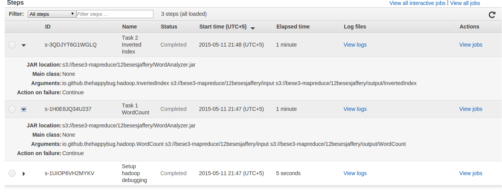
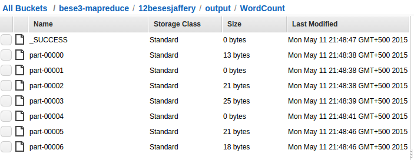
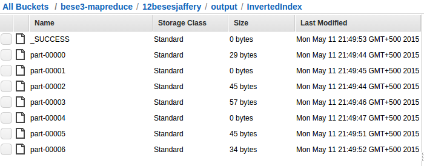

# Lab 9 - Advanced Programming

## Classes

There are two classes containing the mappers and reducers for each task.

```
io\
|__ github
	|__ thehappybug
		|__ hadoop
			|__ WordCount
			|__ InvertedIndex
```

## Configuration on AWS-EMR

Here's what the configuration for `WordCount` and `InvertedIndex` map-reduce tasks look like:



When I run them, I get two output folders in my S3 folder: 

* `s3://bese3-mapreduce/12besesjaffery/output/WordCount`
* `s3://bese3-mapreduce/12besesjaffery/output/InvertedIndex`

These contain the output from the two tasks.



